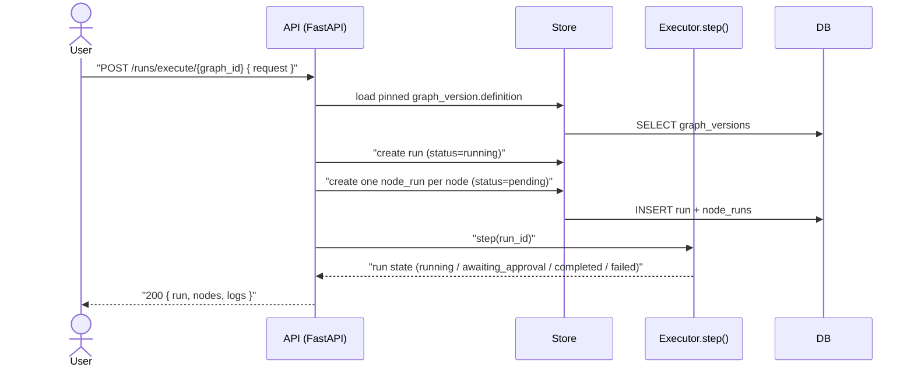
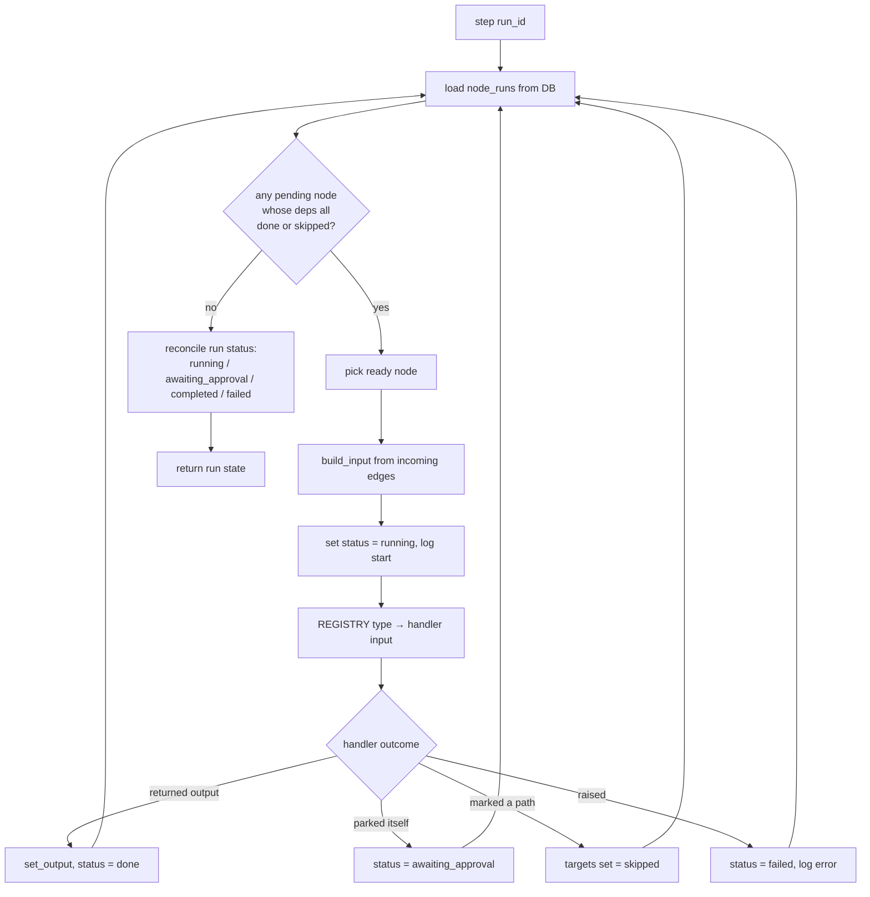
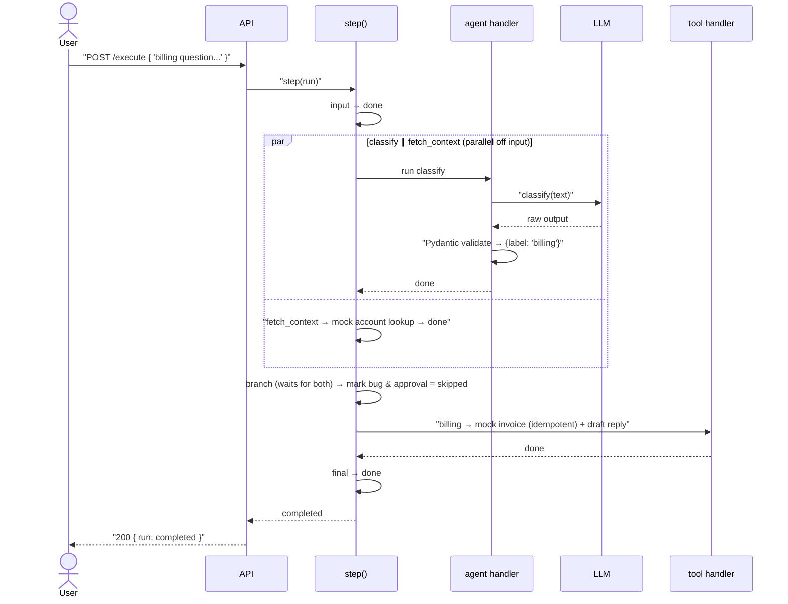
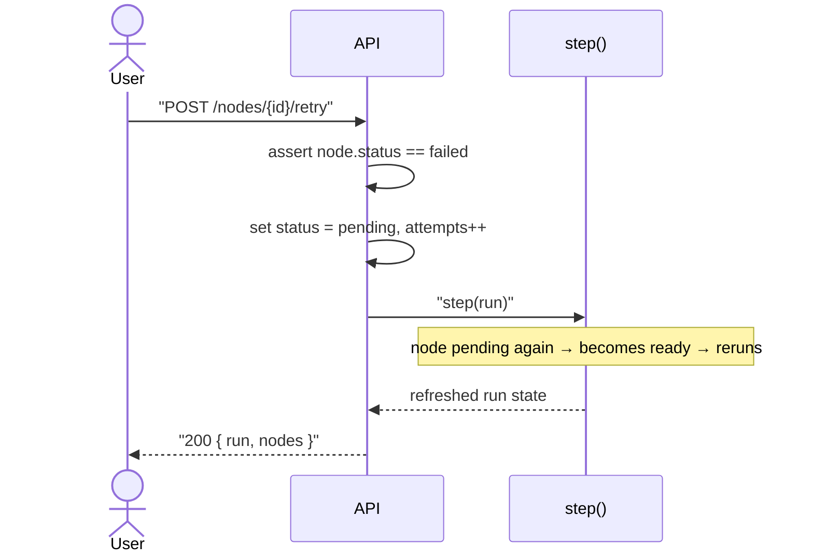
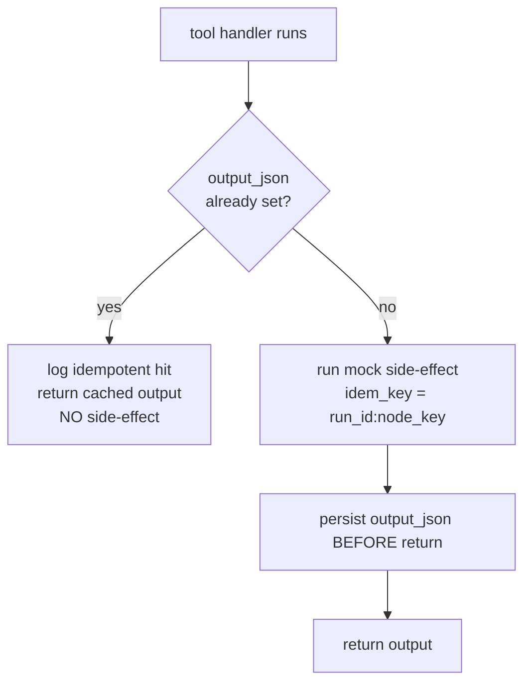

# Code Flow — Agentic DAG Engine

## When you hit `POST /runs/execute/{graph_id}`



## When `step()` runs (the engine loop)



## When a request takes the branch + tool path



## When a request hits the human-approval path (pause + resume)

```mermaid
sequenceDiagram
    actor User
    participant API
    participant Exec as step()

    User->>API: "POST /execute { 'vague request...' }"
    API->>Exec: "step(run)"
    Exec->>Exec: "input → (classify{label:'unclear'} ∥ fetch_context) → branch"
    Note over Exec: bug & billing set skipped
    Exec->>Exec: "approval node → status = awaiting_approval"
    Note over Exec: no ready nodes → loop halts
    Exec-->>API: awaiting_approval
    API-->>User: "200 { run: awaiting_approval }"

    User->>API: "POST /nodes/{approval_id}/approve"
    API->>Exec: "set approval = done; step(run)"
    Exec->>Exec: final → done
    Exec-->>API: completed
    API-->>User: "200 { run: completed }"
```

## When you retry a failed node



## When a tool node is retried (idempotency)


